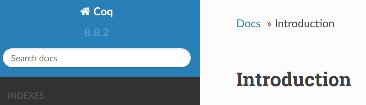
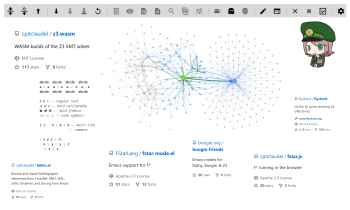
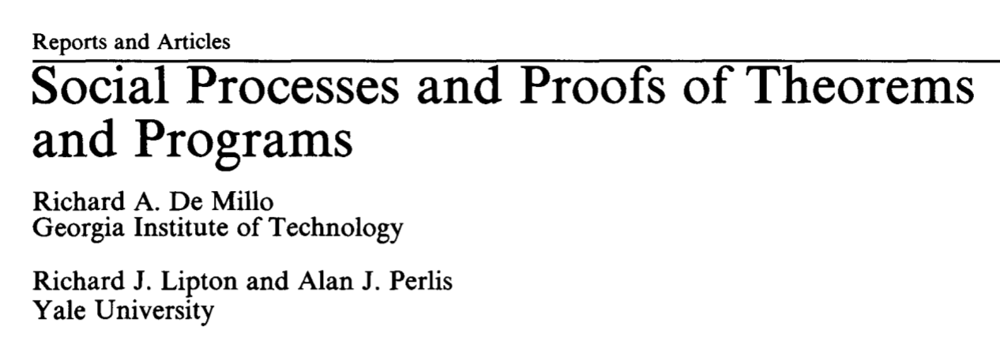
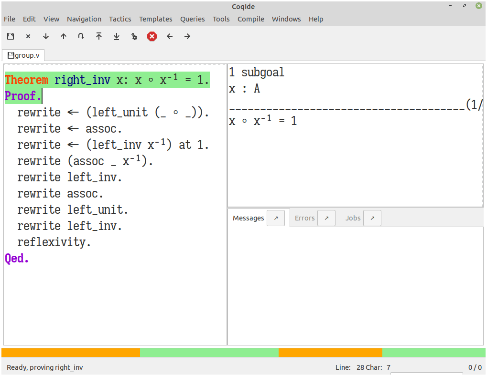
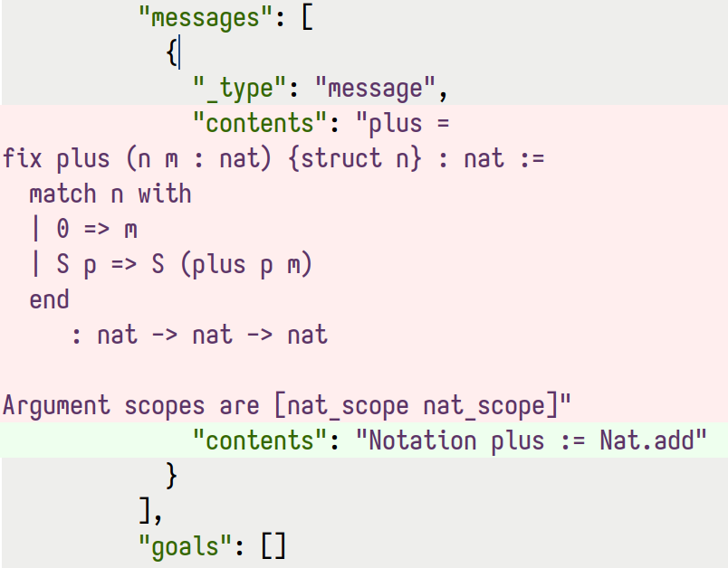
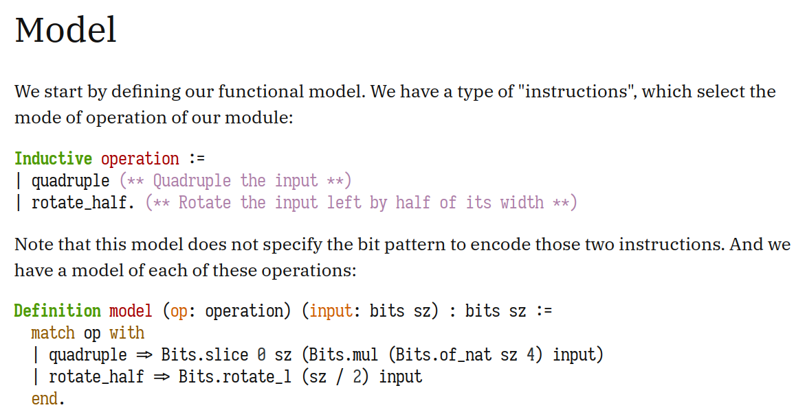
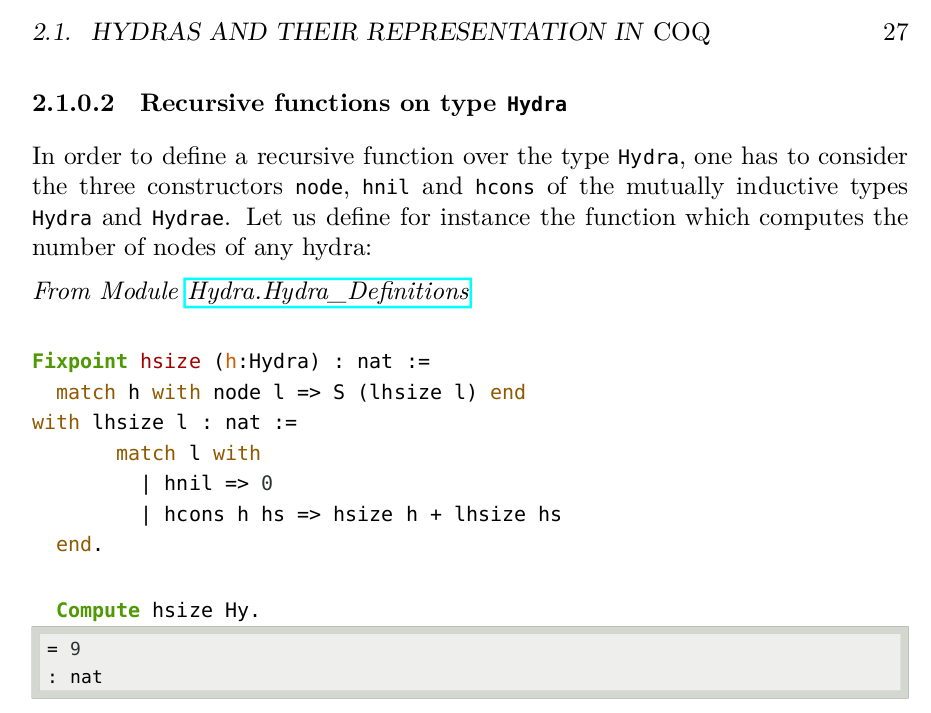
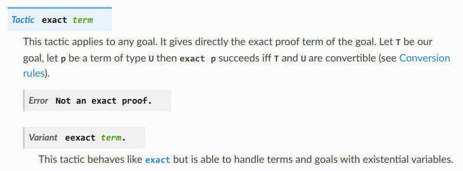

:title: Coq meets literate programming: Tools for documenting, preserving, and sharing mechanized proofs
:css: talk.css
:css: alectryon.css
:css: tango_subtle.css
:js-body: talk.js
:js-body: alectryon.js
:slide-numbers: true
:data-transition-duration: 0.01
:alectryon/serapi/args: -Q /home/clement/git/alectryon/talk/coq/ ""

.. :auto-console: true

----

.. raw:: html

   

   

.. container:: titlepage

   .

================================
 Coq meets literate programming
================================

Tools for documenting, preserving, and sharing mechanized proofs
================================================================

Clément Pit-Claudel
-------------------

CoqPL 2022
----------

.. note::

   Thanks for the introduction!  It's a real honor to be able to talk to you all today.  I'll prefix this by saying that this was work that was done while I was a student at MIT (and I'm interested in continuing once I move to EPFL, which is where I'll be teaching next year), but it's completely disconnected from what I do at my current employer AWS.

---

=====================
 A bit of background
=====================

.. note::

   This talk is about literate programming and Coq tools, but let me take a step back and give you a bit of context.
   At heart, I'm a programmer, and there's nothing that gives me more joy than building stuff.  And I find that the best motivation for *building* something is *needing* something.

----

.. container:: sidebyside

   .. image:: coqpl22/coversearch.png

   .. image:: coqpl22/synchronicity.png

.. note::

   Back in the day "needing something" meant building backup software and software to download album covers from my MP3 player for MP3 players.

---

.. note::

   Later on, when I didn't get enough sleep because of too much time spent building tools, it meant building alarm clock software to wake up in the morning.  This was back in the days were MP3 players were a separate thing from phones and you carried them in separate pockets, and I programmed mine to wake up at a certain time and start playing music.

   That was, incidentally, one of my first times writing real C code.

---

.. img:: coqpl22/rockbox-bug.png

.. note::

   Spoiler, C is hard.  Back in the day I usually didn't go to bed before midnight, so it took me surprisingly long to realize that if you programmed the alarm for the next day it just didn't ring at all.

   I'd love to say that this is my origin story for doing formal verification and proofs, but I actually didn't come into contact with the Coq proof assistant until about 3 year later.  Since then I've mostly been a systems and compilers person, but amusingly most of my interactions with my community still revolve around tools, specifically tools for the Coq proof assistant.

---

.. image:: coqpl22/company-refman-tactics.png

.. note::

   Early on it was Company-Coq;

---

.. note::

   Then it was Coq's reference manual.

---

.. note::

   And then it was Alectryon, the subject of this talk.

---

.. note::

   And in the meantime a bunch of other tools.  Why am I telling you about all these tools, then? Well, you see, the common thread here is that all these tools started from a place of having an itch to scratch — a need to fulfill — and then sharing the result.  It turns out that in most cases, if you have an itch, many many other people have that same each.  What this means is that there are very few itches that are not worth your time to scratch.

   Which is great, because boy, are there itches to scratch in the world of proof assistants!

   It's funny: if your language has very limited tools, then the only people who use it are those who don't need or care about fancy tools.  You end up selecting just the people who are good enough to survive with limited tools.

   Unsurprisingly, it turns that people who don't need tools also don't *write* tools.  Rinse, repeat, and you get to where we are now.

---

.. image:: is_it_worth_the_time.png

.. container:: img-credit

   (XKCD: `<https://xkcd.com/1205/>`__)

.. note::

   There's this popular XKCD comic from right around the time I started my PhD.  Here's what it says: (explain the comic).

   This is all well and good if you're working in a vacuum, but there's something misleading about this comic: it says "you" everywhere, so all the calculation assume that you're pitching your time against your time.

   But if you're writing tools that you share with other people, then all this work gets leveraged.  You get to apply a multiplier of tens, hundreds, thousands, or even millions to this "how often you do the task row".

   And if it gets you invited to give a keynote at some point down the line and reminisce about MP3 players, what's not to love?
   Writing tools is just *that cool*.

---

.. img:: coqpl22/proof-presentation.jpg

.. note::

   Alright, so, what itch are we scratching today?  In one word, “proof presentation” — specifically, the presentation of proof scripts in an interactive theorem prover, like Coq.

   Proof presentation is everything that has to do with displaying a proof, explaining it to another human being, and sharing it with readers.

---

1. Presenting proofs with Alectryon
2. Demo
3. Rendering proofs & future work

.. note::

   Here's the plan for today.  First, I'm going to tell you more about the specific problem that we're trying to solve, and how Alectryon solves this problem.  Then I'll show you how it works concretely, and finally I'll spend some time outlining an interesting research problem that I'd like to be the next step in this journey.

---

.. image:: groups-proofweb.png

.. note::

   Traditionally, a math proof looks roughly like this.  Here we are proving that in a semigroup with a left identity, left inverses are also right inverses.

   This style of proof is called "calculational": the proof is basically a sequence of equalities, with explanations next to each of them.

---

.. code:: isabelle

   theorem right-inv: x ◦ x⁻¹ = 1
   proof –
     have x ◦ x⁻¹ = 1 ◦ (x ◦ x⁻¹)
       by (rule left-unit [symmetric])
     also have ... = (1 ◦ x) ◦ x⁻¹
       by (rule assoc [symmetric])
     also have 1 = (x⁻¹)⁻¹ ◦ x⁻¹
       by (rule left-inv [symmetric])
     also have ... ◦ x = (x⁻¹)⁻¹ ◦ (x⁻¹ ◦ x)
       by (rule assoc)
     also have x⁻¹ ◦ x = 1
       by (rule left-inv)
     also have ((x⁻¹)⁻¹ ◦ ...) ◦ x⁻¹ =
                (x⁻¹)⁻¹ ◦ (1 ◦ x⁻¹)
       by (rule assoc)
     also have 1 ◦ x⁻¹ = x⁻¹
       by (rule left-unit)
     also have (x⁻¹)⁻¹ ◦ ... = 1
       by (rule left-inv)
     finally show x ◦ x⁻¹ = 1.
   qed

.. note::

   This Isabelle proof does a decent job of capturing this structure.  It's not exactly the same steps, but it shows the same interleaving of proof rules and proof states.

---

.. coq:: none

   Module Group.
   Axiom A: Type.
   Axiom prod: A -> A -> A.
   Axiom inv: A -> A.
   Axiom unit: A.

   Notation "1" := unit.
   Infix "◦" := prod (at level 25).
   Notation "x ⁻¹" := (inv x) (at level 8, format "x ⁻¹").

   Print Grammar constr.

   Axiom assoc :
     forall x y z, (x ◦ y) ◦ z = x ◦ (y ◦ z).

   Axiom left_unit :
     forall x, 1 ◦ x = x.

   Axiom left_inv :
     forall x, x⁻¹ ◦ x = 1.

   Require Import Setoid.

.. coq:: no-hyps

   Theorem right_inv x: x ◦ x⁻¹ = 1.
   Proof.
     rewrite <- (left_unit (_ ◦ _)).
     rewrite <- assoc.
     rewrite <- (left_inv x⁻¹) at 1.
     rewrite (assoc _ x⁻¹).
     rewrite left_inv.
     rewrite assoc.
     rewrite left_unit.
     rewrite left_inv.
     reflexivity.
   Qed.

.. note::

   Now contrast this with the same proof, in Coq.  There is what we want to prove at the top, Qed at the bottom, and some unintelligible gibberish in the middle.

   Proof *script*.  Sequence of steps/tactics like …, from premises to conclusion.

   Not what mathematicians call “a proof”.
   Missing *goals*, …. That's because computed.

---

.. note::

   There was a fierce debate in the 1980s about exactly what constituted a proof, and whether software proofs and computer-based proofs were as valuable as mathematical proofs.

   People use to fight about this!  To exaggerate: who cares whether proofs are correct, if they are interesting? (Read the quotes)

   There's something valid to this argument: there is something joyful and fascinating about understanding things deeply that is wholly disconnected from knowing whether a paper proof covers all the minute details and corner cases correctly.

---

.. code:: coq

   Theorem compiler_correct:
     interp program = lift (interp_compiled (compile program)).

.. note::

   Of course, not do be overdone, some of us swing all the way to the other side.  Here is an example: this theorem states correctness for a compiler I wrote not so long ago.  If you're going to use the compiler, does it matter how the 5000 lines Coq proof works?  Its so automated that there are places where even I don't know exactly how it works.  Heck, the best part of my job is when I change the compiler and the proof automation is good enough that it keeps going through.  It tells me the one thing that I care about, which is that the compiler is actually correct.

---

.. note::

   Of course not all proofs are like that: often we are looking to communicate something through the proof.  We are not just proving things to make sure that we're correct; we're also hoping to share the proof.  In Coq the way we can do this is by running inside of a proof assistant.

   If readers have Coq installed, OK.
   But sometimes not right version, or proof has dependencies, or compilation slow, or mobile phone, or browsing casually, or… writing book!

   So what do people do to write manuals, tutorials, textbooks, blog posts, or any other piece of text that mixes Coq proofs and prose?

---

.. coq:: no-hyps

   Theorem right_inv2 x: x ◦ x⁻¹ = 1.
   Proof.
     rewrite <- (left_unit (_ ◦ _)).
     (* 1 ◦ (x ◦ x⁻¹) = 1 *)
     rewrite <- assoc.
     (* (1 ◦ x) ◦ x⁻¹ = 1 *)
     rewrite <- (left_inv x⁻¹) at 1.
     (* (((x⁻¹)⁻¹ ◦ x⁻¹) ◦ x) ◦ x⁻¹ = 1 *)
     rewrite (assoc _ x⁻¹).
     (* ((x⁻¹)⁻¹ ◦ (x⁻¹ ◦ x)) ◦ x⁻¹ = 1 *)
     rewrite left_inv.
     (* ((x⁻¹)⁻¹ ◦ 1) ◦ x⁻¹ = 1 *)
     rewrite assoc.
     (* (x⁻¹)⁻¹ ◦ (1 ◦ x⁻¹) = 1 *)
     rewrite left_unit.
     (* (x⁻¹)⁻¹ ◦ x⁻¹ = 1 *)
     rewrite left_inv.
     (* 1 = 1 *)
     reflexivity.
   Qed.

.. note::

   In most cases they do something like this: they run the proof in Coq and then, by hand, they copy the output of each tactic into source code comments.

----

.. code:: coq

   Require Import Arith.
   Print fact.
   (** [[
   fact =
   fix fact (n : nat) : nat :=
     match n with
     | 0 => 1
     | S n0 => S n0 * fact n0
     end
        : nat -> nat
   ]]
   *)

(CPDT)

.. note::

   Here's what it looks like in Certified Programming with Dependent Types.

----

.. code:: coq

   pose D x := if x is 2 then False else True.

   (**
   [[
     H : 2 === 1
     D := fun x : nat =>
          match x with
          | 0 => True
          | 1 => True
          | 2 => False
          | S (S (S _)) => True
          end : nat -> Prop
     ============================
      False
   ]] **)

(Programs and Proofs)

.. note::

   Here's what it looks like in Illya's Programs and Proofs.

----

.. code:: coq

   Print Assumptions function_equality_ex2.
   (* ===>
        Axioms:
        functional_extensionality :
            forall (X Y : Type) (f g : X -> Y),
                   (forall x : X, f x = g x) -> f = g *)

(Software foundations)

.. note::

   Here's what it looks like in Software Foundations.

   Super cumbersome.  Lots of work, lots of mistakes.
   Copy pasted output gets out of sync — we all know even high level comments get out of sync fast.

   Wait for readers to find the issues.

   There's got to be a better way, and that's where Alectryon comes in.

   Alectryon two things:

   1. Compiler: captures Coq output and interleaves it in original proof script as webpage.
   2. Literate programming system for Coq.

----

.. container:: alectryon-block

   .. coq:: no-hyps

      Theorem right_inv2 x: x ◦ x⁻¹ = 1.
      Proof.
        rewrite <- (left_unit (_ ◦ _)).
        rewrite <- assoc.
        rewrite <- (left_inv x⁻¹) at 1.
        rewrite (assoc _ x⁻¹).
        rewrite left_inv.
        rewrite assoc.
        rewrite left_unit.
        rewrite left_inv.
        reflexivity.
      Qed.

.. note::

   Here's the same proof.  Took file, fed Coq, collected output, formatted, and generated interactive visualization.

   Interactive webpage; every proof step is button that reveals proof state.

   After every change can rerun Alectryon and regen the page.

   Outputs recorded, all static: no need to load Coq.

   Everything is web technologies → flexible rendering.

---

.. coq:: unfold

   Lemma Gauss: ∀ n, 2 * (sum n) = n * (n + 1). (* .fold *)
   Proof. (* .fold *)
     induction n. (* .fold *)
     - (* n ← 0 *)
       reflexivity.
     - (* n ← S _ *)
       cbn [sum].
       rewrite Mult.mult_plus_distr_l.
       rewrite IHn.
       ring_simplify.
       reflexivity.
   Qed.

.. note::

   Here's what it looks on another simple proof.

----

.. container:: coq-mathjax

   .. coq:: unfold

      Module Gauss. (* .none *)
      Import LatexNotations. (* .none *)
      Lemma Gauss: ∀ n, 2 * (nsum n (fun i => i)) = n * (n + 1).
      Proof. (* .fold *)
        induction n; cbn [nsum]. (* .fold *)
        - (* n ← 0 *)
          reflexivity.
        - (* n ← S _ *)
          rewrite Mult.mult_plus_distr_l.
          rewrite IHn. (* .no-hyps *)
          ring.
      Qed.
      End Gauss. (* .none *)

.. note::

   Use web tech to give meaningful rendering.

----

.. coq::

   Section classical. (* .none *)
     Context (excl: ∀ A, A ∨ ~ A).
     Goal ∀ A, ¬¬A → A.
       intros A notnot_A. (* .in *)
       Show Proof. (* .messages .unfold *)
       destruct (excl A) as [a | na]. (* .in *)
       Show Proof. (* .messages .unfold *)
       - assumption. (* .in *)
         Show Proof. (* .messages .unfold *)
     Abort. (* .none *)
   End classical. (* .none *)

.. note::

   Here's different example of using Alectryon to help readers develop better understanding.

   And that's what first part of Alectryon is about!  Alectryon automatically annotates proof scripts with Coq's output, generating a complete record of the proof that captures the intermediate proof states and renders them.

----

.. coq::

   (** So far, it looks like co-inductive types might be a magic
       bullet, allowing us to import all of the
       Haskeller's usual tricks. …

       The restriction for co-inductive types shows up as
       the%\index{guardedness condition}% _guardedness
       condition_.  First, consider this stream definition,
       which would be legal in Haskell.

       [[
       CoFixpoint looper : stream nat := looper.
       ]]

       <<
       Error:
       Recursive definition of looper is ill-formed.
       In environment
       looper : stream nat
       unguarded recursive call in "looper"
       >> **)

.. note::

   OK, so this solves 1 problem: displaying goals and outputs.
   But there's another aspect of writing about Coq proofs: the explanatory prose.

   There's no code here: it's all prose, embedded in source code comments.

   Lots of respect.  Whole other level of determination and grit to edit whole book in comments.

----

.. code:: coq

   (*|
   A fairly common occurrence when working with dependent
   types in Coq is to call `Compute` on a benign expression
   and get back a giant, partially-reduced term, like this:
   |*)

   Import EqNotations Vector.VectorNotations.
   Compute (hd (rew (Nat.add_1_r 3)
                    in ([1; 2; 3] ++ [4]))). (* .unfold *)

   (*|
   This post shows how to work around this issue.
   |*)

.. note::

   Shouldn't have to be this way; I want to use a text editor for text, and a code editor for code.

   Alectryon solves this by allowing you to toggle between views of your code.

   First looks very similar; but then I can switch to “prose mode”.
   Uses reStructuredText, very popular.
   Switch back.

   In prose mode get completion of english words, spellchecking, live preview.
   In code mode get Proof General experience, ITP.

----

.. code:: rst

   A fairly common occurrence when working with dependent
   types in Coq is to call `Compute` on a benign expression
   and get back a giant, partially-reduced term, like this:

   .. coq::

      Import EqNotations Vector.VectorNotations.
      Compute (hd (rew (Nat.add_1_r 3)
                       in ([1; 2; 3] ++ [4]))). (* .unfold *)

   This post shows how to work around this issue.

.. note::

   This is what it looks like after flipping the code and the prose around.  The syntax is reStructuredText.  reStructuredText is a great markup language, very much like Markdown but with a robust story for writing extensions; in fact, I used this whole presentation is just one large Coq file; I used Alectryon to convert it to reStructuredText.

   The best part is that you can go back: once you're done editing the prose of your document and you're ready to resume hacking on the proofs, you can use Alectryon to convert the reStructuredText file back into a Coq source file, in which the prose is wrapped in special comments and the code is at the top level.  Here, let's go back to the original code.

----

.. image:: emacs-screenshot.svg
   :alt: A screenshot of Emacs shows the same snippet from Software foundations, in code and prose views.

.. note::

   These two transformations are the inverse of one another, so you can switch between the code-oriented view and the prose-oriented view at will.  This is trivial to integrate into an IDE; I did it for Emacs, and I'm sure it would be very easy to do in any other editor.

   Being able to go back and forth between reStructuredText and Coq means that Alectryon does not have to implement its own markup language for literate comments: it can just piggyback on the existing reStructuredText toolchain, which is very robust and used by a lot of people for all sorts of documents, like the reference manuals of Python, Agda, Haskell, and a host of other languages — including Coq.

----

.. role:: red
   :class: red

.. role:: green
   :class: green

.. container:: xxxl

   :red:`✗` LaTeX ← literate document → Coq

   :green:`✓` reST ⇆ Coq

.. note::

   If you know literate, you might be confused.
   Normally tangling and weaving.
   There's a main document that you edit, then two views that you generate.
   Can't edit those.

   Not too bad except tooling for regular languages.

   Unusable for Coq: need interactive UI.  Hence all proof-heavy books written as Coq files.

   Alectryon is different: no main document, just tangled and weaved, and bidirectional conversion.  Chose which one to work with as needed.

----

.. raw:: html

   
   

.. container:: rbt-no-printing

   .. coq::

      Require Import RBT. (* .none *)
      Module RBT1. (* .none *)
      Definition build_trees (leaves: list nat) :=
        List.fold_left (fun trs n => RBT.add n (hd RBT.empty trs) :: trs)
          leaves [] |> List.rev.

      Compute build_trees [1;2;3;4;5]. (* .unfold *)
      Compute build_trees [2;1;4;3;6].
      End RBT1. (* .none *)

.. note::

   Concrete example: understand red-black trees.

----

.. container:: rbt-render

   .. coq::

      Module RBT2. (* .none *)
      Import RBTNotations. (* .none *)
      Definition build_trees (leaves: list nat) :=
        List.fold_left (fun trs n => RBT.add n (hd RBT.empty trs) :: trs)
          leaves [] |> List.rev.

      Compute build_trees [1;2;3;4;5]. (* .unfold *)
      Compute build_trees [2;1;4;3;6]. (* .unfold *)
      End RBT2. (* .none *)

.. note::

   Now with graphs!

----

.. image:: udiv.opt.paths.svg
   :alt: A piece of Coq code showing a binary object rendered by passing it to objdump and highlighting the result.

.. note::

   Second example: objdump.

----

.. image:: life.svg

.. note::

   Third example: life

-----

.. image:: rss.paths.svg
   :class: img-m

.. note::

   And here instead is a completely different rendering: plain HTML.  Careful to use the right web tech to support wide range of use cases, including RSS feeds.

---

.. note::

   I won't dive deep into the way Alectryon is implemented, but I'll point out one thing: it's smart enough to decouple your prose from your code, and to cache the results of running the code.  The result is that you get a stable archive of the whole proof, not just the scripts, and you can use that to check for breakage over time.

---

Demo!

- Basics: Coq document
- IDE support
- Mini-language for customized display
- References and Quotes
- Custom driver
- Extensions for custom rendering
- Polyglot documents
- Diffs on JSON

---

Taking stock
============

.. note::

   Backing up a bit, let me try to address what's missing.  First I'd like to broaden our perspective on documentation a bit, and second I'd like to talk about a recent development, along with a challenge.

---

What's documentation, anyway?
-----------------------------

Internal, external, and per-object.

.. note::

   I'd argue that given a Coq development, there are really three kinds of documentation that we may want: internal, external, and per-object.

---

.. note::

   The first one is “internal documentation”.  It's what Alectryon was originally developed for: interleaving commentary and code in a way that still lets the reader process everything sequentially.  It's exhaustive: the intent is that it serves as a prose description of what's happening throughout a document.  This is the kind of document that you use when you want your reader to be able to reproduce the same tricks.

   This is the mode of operation that I used to write my PhD thesis, this talk, and that people have been using for recitations and lectures.

---

.. note::

   The second one is “external documentation”.  Here the idea is that you have a Coq development that accompanies a mathematical text, but the two live separately.  Still, you want them to be closely connected, so you import definitions, proof fragments, etc. from the Coq code into the math document.  This is the kind of doc you use when you want the reader to have a high-level understanding, coupled with specific places where you zoom in.

   Originally Alectryon didn't support this at all, but recently I've had the pleasure of working with Pierre, Karl, and Théo on extending it.

   The way we did this is by adding markers into the Coq code to make it clear which bits we wanted to import, and using a custom Alectryon driver; but in the long run I'd like to improve Alectryon's quoting and cross-referencing facilities to make this even easier.

---

.. note::

   The third one is per-object documentation: this is the programmer's view of the system.  This is not intended to tell a story or pull multiple objects together; instead, it's an exploded view that documents each object one at a time.

   We don't have a story about this in Alectryon at the moment, short of documenting objects separately from their definitions.  This is what we do in the reference manual of Coq, in fact: we document each object using reStructuredText constructs.

---

.. code:: rst

   .. quote:: unfold

      .m(Coq.Lists.List).d#app_inj_tail.s(induction).g#2

   .. quote::
      :from: .m(Coq.Lists.List).d#app_inj_tail.s(induction)
      :to: .m(Coq.Lists.List).d#app_inj_tail.s(auto.)

.. note::

   In the long run I'd like to see better integration of docstrings and per-object documentation into Alectryon.  The idea would be that just like the external docs allow you to pull proof fragments and definitions from a file, they should allow you to pull complete objects, including their docstrings, to allow you to weave a story around these objects, like documenting an API.

   I'm looking for collaborators to work on these aspects, and I hope that you'll join me to build the next generation of self-documenting Coq proofs.

---

On rendering proof objects
--------------------------

.. note::

   The second aspect that I'd like to spend a bit more time on is rendering.  I've given a few demos already, but let me walk through a different example.

---

.. code:: coq

   (f2 ~> Cell d1 c2 ∗ p1 ~> Queue f1 b2 ∗
    p2 ~> Queue f2 b2 ∗ b1 ~> Cell x c2 ∗
    c2 ~> ListSeg b2 L2' ∗ b2 ~> Cell d2 null ∗
    f1 ~> ListSeg b1 L1)

.. note::

   Here is a separation logic formula.  It captures the way some objects are laid out in memory.
   (Describe the formula)

---

.. note::

   Here is the same formula, rendered in a way that I hope we can all agree is more pleasant.  (Talk more about it)

---

Demo!

.. note::

   TODO: Step through sep logic proof from Arthur.
   TODO: Demo how this works:

   - Coq notation to print easily parsable notation
   - PEG grammar to parse sep logic
   - JS library to cluster the graph and translate it to DOT
   - Graphviz library compiled to JavaScript to generate the rendering

---

It's a hack!
------------

.. note::

   This is all nice and well, but it's a hack!  It works for this small example because of the specific way I've designed it, and the same is true for most of these rendering examples that I've shown you.  Think of using LaTeX to render math, for example: it doesn't scale to large Coq terms, and it requires hacking Coq notations.

---

Doing it right
--------------

- Allow alternative notation domains
- Define a rendering language

.. note::

   What's the non-hacky way to do this?

   It's "easy": first we need to allow users to define their own notations.  Basically, we want to extend Coq's notation system to support alternative notation domains: you'd define how to map your Coq code not just to text, but to pictures, latex, etc.  Conveniently, because the notations are not reparseable, we don't can just pass the AST to a tactic that has full introspection access to the term, instead of having to do notations the way they are currently done in Coq.

   Notations in these alternative domains would be expressed in domain-specific languages: one for graphs, one for LaTeX math, one for pretty-printed text, one for syntax highlighting, etc.

   The lean folks already do some of this, btw: there's really cool work on widgets that lets you map arbitrary lean structures to HTML.
   I think the problem is that it puts too much responsibility on the programmer.  This will become clear when I walk through the challenges.

---

Challenges
----------

- It requires continuous solutions
- It's optimization problem across multiple domains
- It needs to work well statically but also to allow editing

.. note::

   There are many challenges that make this problem a bit different from traditional DSLs for drawing pictures.

   - First, it requires continuous solutions: small changes in goal ⇒ small changes in picture.  This rules out naive randomized "best placement" algorithms.

     And we want it to work even with partial proofs, so we can't optimize by looking at all proof states.

   - Second, things get really hairy when you get into multiple domains: LaTeX in nodes of graph, or Coq code within deduction rule syntax, etc.  (Describe issue with Coq code inside graph: sep logic *and* RB tree w/ unknown subtree)

   - Third, we're hoping that this works for static media like paper, and even if we can assume interactive media we want users to not have to click through too much.  So, we need a lot of customizability.

     And we need to figure out editing.  My current thinking on this is that we can cheat a bit.  It turns out that in most cases the hierarchical structure of the text is reflected in the figure, and each part of the figure maps to a piece of text, recursively; so, we can just revert to text for the part of the figure that's being edited.

---

Thanks!
=======

.. image:: citations.paths.svg

.. note::

   And that's what I'll leave you with!  I've shown some of the related work on this side, because everything that I've presented here exists thanks to almost a century of efforts and reflection.

   To recap, Alectryon provides an architecture to record and visualize Coq proofs, which facilitates sharing and interactive exploration of proof scripts, and a bidirectional translator between woven and tangled documents, enabling seamless editing of prose and code.  The next step is to invest in rendering: please come talk to me if you're curious about these issues, and let's use the remaining time we have to discuss what I've missed!
