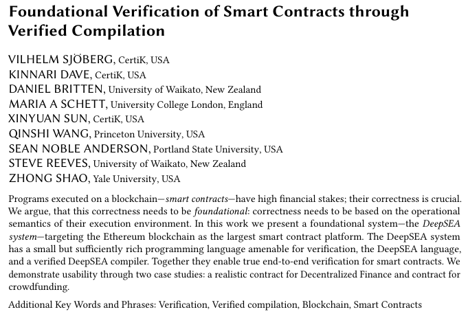
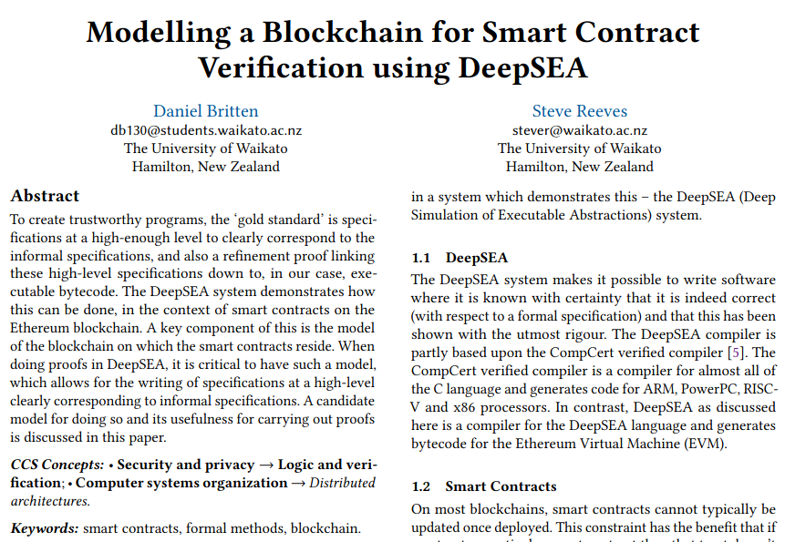
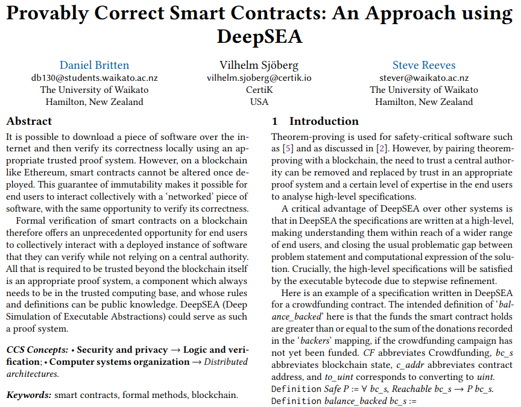
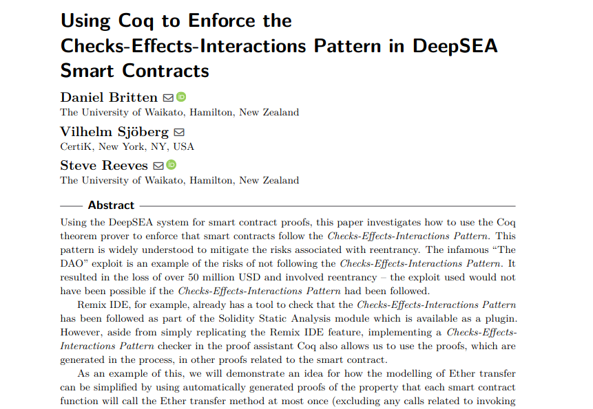

:title: ERC-20 Wrapped-ETH Verification in DeepSEA
:css: talk.css
:css: alectryon.css
:css: tango_subtle.css
:js-body: alectryon.js
:slide-numbers: true
:data-transition-duration: 0
:alectryon/serapi/args: -R /run/media/daniel/WORK/DeepSEA-ERC20-Talk/PhD-Thesis-Code-Artefact/DeepSEA DeepSpec -R /run/media/daniel/WORK/DeepSEA-ERC20-Talk/PhD-Thesis-Code-Artefact/Chapter-5-Case-Study-Crowdfunding/Crowdfunding Crowdfunding -R /run/media/daniel/WORK/DeepSEA-ERC20-Talk/PhD-Thesis-Code-Artefact/Trivial/trivial trivial -R /run/media/daniel/WORK/DeepSEA-ERC20-Talk/PhD-Thesis-Code-Artefact/Chapter-5-Case-Study-Crowdfunding/proofs SmartContract

.. :auto-console: true

----

==========================================
ERC-20 Wrapped-ETH Verification in DeepSEA
==========================================

Daniel Britten
==============

----

**Overview:**

- Trivial Example in DeepSEA
- ERC-20 Implementation
- Property: Preservation of Wrapped-ETH records
- Property: Transfer Correctness
- Safety Property: Total Supply Variable Tracks
- Safety Property: Sufficient Funds Safe
- Side-note: Unsigned Integer Side-conditions
- Formal Verification Effort

----

**Trivial Example in DeepSEA**

Example: Trivial contract converting `bool` to `int` and keeping track of if it has ever been passed the input `true`

----

.. code:: ocaml

  object signature trivial = {
      const boolToInt : bool -> int;
      boolToIntTracker : bool -> int
  }

  object Trivial : trivial {
      let seenTrueYet : bool := false

      let boolToInt b =
        if b then 1 else 0

      let boolToIntTracker b =
        if b then
          begin
              seenTrueYet := true;
              1
          end
        else 0
  }

  layer CONTRACT = { o = Trivial }

----

.. code:: bash

  $ dsc trivial.ds bytecode
  5b60005b60206109205101610920525b61022660006020610920510301525b60006020
  610920510301516101005260206101002060006020610920510301525b600060006020
  61092051030151555b60206109205103610920525b60005b9050386300000073600039
  386000f35b60006000fd5b610940610920527c01000000000000000000000000000000
  000000000000000000000000006000350480635192f3c01463000000495780631e01e7
  071463000000965760006000fd5b6004355b60006109205101610920525b8063000000
  67576300000085565b600190505b60006109205103610920525b805b90506000526020
  6000f35b60009050630000006c565b60006000fd5b6004355b60206109205101610920
  525b8063000000b4576300000111565b61022660006020610920510301525b60006020
  610920510301516101005260206101002060006020610920510301525b600160006020
  61092051030151555b600190505b60206109205103610920525b805b90506000526020
  6000f35b6000905063000000f8565b60006000fd

----

`$ dsc trivial.ds abi`

.. code:: json

  [ {"type":"constructor",
    "name":"constructor",
    "inputs":[], "outputs":[], "payable":false,
    "constant":false, "stateMutability":"nonpayable"},
  {"type":"function",
    "name":"boolToInt",
    "inputs":[{"name":"b", "type":"bool"}],
    "outputs":[{"name":"", "type":"uint256"}],
    "payable":false,
    "constant":true,
    "stateMutability":"view"},
  {"type":"function",
    "name":"boolToIntTracker",
    "inputs":[{"name":"b", "type":"bool"}],
    "outputs":[{"name":"", "type":"uint256"}],
    "payable":true,
    "constant":false,
    "stateMutability":"payable"}]

----

.. coq:: none

  Require Import String.
  Require Import trivial.DataTypeOps.
  Require Import trivial.LayerCONTRACT.

  Require Import DeepSpec.lib.Monad.StateMonadOption.
  Require Import DeepSpec.lib.Monad.RunStateTInv.
  Require Import lib.ArithInv.
  Import DeepSpec.lib.Monad.Monad.MonadNotation.

  Require Import Lia.
  Require Import List.
  Require Import Bool.
  Require Import ZArith.
  Require Import cclib.Maps.
  Require Import cclib.Integers.

  Require Import DataTypes.
  Require Import backend.MachineModel.

  Require Import DataTypes.
  Import ListNotations.

  Require Import core.MemoryModel. 
  Require Import HyperTypeInst.

  Require Import Maps.
  Import Maps.Int256Tree_Properties.
  Import Maps.Int256Tree.

  Require Import trivial.ContractModel.
  Import trivial.ContractModel.ContractModel.

  Require Import Syntax.
  
  Open Scope Z.

  Section Proof.  
  Context (contract_address : addr).
  Context {memModelOps : MemoryModelOps mem}.

`$ dsc trivial.ds coq ...`

.. code:: coq

  if f then ret 1 else ret 0

.. coq:: fold

  Require Import Syntax. (* .none *)
  Print Trivial_boolToInt_opt.
  Print Trivial_boolToInt.

----

`$ dsc trivial.ds coq ...`

.. code:: coq
  
  if f then
    MonadState.modify (update_Trivial_seenTrueYet true) ;;
    ret 1
  else
    ret 0

.. coq:: fold
  
  Print Trivial_boolToIntTracker_opt.
  Print Trivial_boolToIntTracker.

----

.. coq:: fold

  Lemma boolToInt_proof : forall input context before result after HContext1 HContext2 HContext3,
    let machine_environment :=
      (make_machine_env contract_address before context (fun _ _ _ _ => true) HContext1 HContext2 HContext3) in

    runStateT (Trivial_boolToInt_opt input machine_environment) (contract_state before)
      = Some (result, after)
    
    ->
    
    result = 1 <-> input = true.

----

Goal:

.. code:: coq

  result = 1 <-> input = true

.. coq:: fold
  
  Proof. (* .all -.h#memModelOps *)
    intros. (* .all -.h#machine_environment -.h#memModelOps *)
    Transparent Trivial_boolToInt_opt. (* .all -.h#* .h#H *)
    unfold Trivial_boolToInt_opt in H. (* .all -.h#* .h#H *)
    split; intros. (* .all -.h#* *)
      - (* "->" result is 1 ∴ input is true. *) (* .all -.h#* .h#H .h#H0 *)
        inv_runStateT_branching. (* .all -.h#* .h#Heqb .h#H0 .h#H1 .h#H2 *)
        + (* Go down true branch of if statement. *) (* .all -.h#* .h#Heqb .h#H0 .h#H1 .h#H2 *)
          reflexivity.
        + (* Go down false branch of if statement, gives a contradiction. *) (* .all -.h#* .h#Heqb .h#H0 .h#H1 .h#H2 *)
          subst. (* .all -.h#* .h#H1 *) discriminate.
      - (* "<-" input is true ∴ result is 1. *)  (* .all -.h#* .h#H .h#H0 *)
        inv_runStateT_branching. (* .all -.h#* .h#Heqb .h#H0 .h#H1 .h#H2 *)
        + (* Go down true branch of if statement *) (* .all -.h#* .h#Heqb .h#H0 .h#H1 .h#H2 *)
          subst. (* .all -.h#* .h#H0 *)  reflexivity.
        + (* Go down false branch of if statement, gives a contradiction. *) (* .all -.h#* .h#Heqb .h#H0 .h#H1 .h#H2 *)
          discriminate.
  Qed.

  Print inv_runStateT_branching.
  Print inv_runStateT1_branching.

.. note::

  Remember to click the extra button to show hypotheses for both goals when they are there.

  Note that some hypothesis are hidden in the visualisations for clarity.

  Next next slide has a copy of the contract definition.

----

.. coq:: none

  Lemma boolToInt_proof' : forall input context before result after HContext1 HContext2 HContext3,
      let machine_environment :=
        (make_machine_env contract_address before context (fun _ _ _ _ => true) HContext1 HContext2 HContext3) in

      runStateT (Trivial_boolToInt_opt input machine_environment) (contract_state before)
        = Some (result, after)
      
      ->
      
      result = 1 <-> input = true.

.. coq:: fold

    Proof.
      intros.
      Transparent Trivial_boolToInt_opt. unfold Trivial_boolToInt_opt in H.
      split;
        inv_runStateT_branching; try subst; try discriminate; try reflexivity.
    Qed.

----

.. code:: ocaml

  object signature trivial = {
      const boolToInt : bool -> int;
      boolToIntTracker : bool -> int
  }

  object Trivial : trivial {
      let seenTrueYet : bool := false

      let boolToInt b =
        if b then 1 else 0

      let boolToIntTracker b =
        if b then
          begin
              seenTrueYet := true;
              1
          end
        else 0
  }

  layer CONTRACT = { o = Trivial }

----

**References**

- Slides powered by Alectryon_: https://github.com/cpitclaudel/alectryon (Also supports Lean 4!)
- The DeepSEA compiler is partly based upon the CompCert_ Verified Compiler
- My papers: https://academic.danielb.space
- C DeepSEA paper: https://dl.acm.org/doi/pdf/10.1145/3360562
- Verified Price Oracles paper: https://doi.org/10.4230/OASIcs.FMBC.2021.1
- arXiv DeepSEA paper: https://arxiv.org/abs/2405.08348

- GitHub links:
    - DeepSEA_
    - My DeepSEA fork_ 
    - The Crowdfunding_ contract

.. _Alectryon: https://github.com/cpitclaudel/alectryon
.. _CompCert: https://compcert.org/
.. _DeepSEA: https://github.com/ShentuChain/deepsea
.. _fork: https://github.com/Coda-Coda/deepsea-1
.. _Crowdfunding: https://github.com/Coda-Coda/Crowdfunding/

----

.. coq:: none

  End Proof.
  Open Scope nat.

============
Extra Slides
============

----

===============
Paper overviews
===============

----

----

----

----

----

----

.. image:: deepsea-paper.png
  :target: https://dl.acm.org/doi/pdf/10.1145/3360562

----

=================
Additional Slides
=================