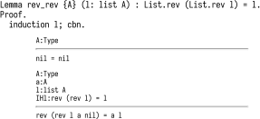
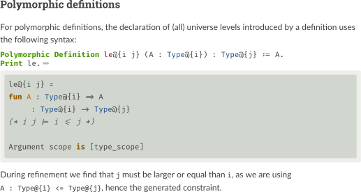
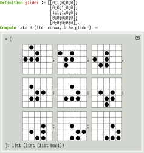

:title: Untangling mechanized proofs
:css: talk.css
:css: alectryon.css
:css: tango_subtle.css
:js-body: talk.js
:js-body: alectryon.js
:slide-numbers: true
:data-transition-duration: 0.01
:alectryon/serapi/args: -Q /home/clement/documents/mit/plv/blog/alectryon/paper/talk/coq/ ""

.. :auto-console: true

----

.. container:: titlepage

   .

==============================
 Untangling mechanized proofs
==============================

Clément Pit-Claudel
===================

SLE 2020
--------

.. note::

   .

----

=====================
 A tour of Alectryon
=====================

.. note::

   Back in undergrad I taught in high school for a few months. There was a proof I liked to show my students, because it surprised most of them.

----

.. raw:: html

   

   

.. container:: xxxxl

   .. math:: \frac{a}{c} + \frac{b}{d} \not= \frac{a + b}{c + d}

.. note::

   This was the setup: every student knows that you can't sum fractions element-wise.
   What many students don't know is that you *can*, actually, as long as long you're just trying to prove an inequality.

----

.. container:: xxxxl

   .. math:: \frac{a}{c} + \frac{b}{d} \ge \frac{a + b}{c + d}

.. note::

   My main line of research is doing proofs with Coq, so let me share a Coq proof of this inequality.

----

.. raw:: html

   

       \(\newcommand{\ccQ}{\mathbb{Q}}\)
       \(\newcommand{\ccNat}{\mathbb{N}}\)
       \(\newcommand{\ccSucc}[1]{\mathrm{S}\:#1}\)
       \(\newcommand{\ccFrac}[2]{\frac{#1}{#2}}\)
       \(\newcommand{\ccPow}[2]{{#1}^{#2}}\)
       \(\newcommand{\ccNot}[1]{{\lnot #1}}\)
       \(\newcommand{\ccEvar}[1]{\textit{\texttt{#1}}}\)
       \(\newcommand{\ccForall}[2]{\forall \: #1. \; #2}\)
       \(\newcommand{\ccNsum}[3]{\sum_{#1 = 0}^{#2} #3}\)
   

.. container:: proof-overlay

   .. code:: coq

      Lemma Qle_pairwise : ∀ a b c d, 0 < a ∧ 0 < b ∧ 0 < c ∧ 0 < d →
        (a + c)/(b + d) ≤ a/b + c/d.
      Proof with Qeauto.
        intros a b c d H.
        field_simplify...
        rewrite <- (Qmult_le_l (b + d)), Qmult_div_r, Qmult_Qdiv_fact...
        rewrite <- (Qmult_le_l (b * d)), Qmult_div_r...
        field_simplify.
        rewrite <- (Qminus_le_l (b * d * a)); ring_simplify.
        rewrite <- (Qminus_le_l (b * d * c)); ring_simplify.
        Qeauto using Qsqr_0.
      Qed.

   .. class:: substep

      .. image:: coq.png
         :class: rooster-sticker

   .. class:: substep

      .. image:: magic.svg
         :class: magic-rooster

.. note::

   That's it.  You can check that the statement at the top matches what I wanted to prove, and there's a Qed at the end, and I promise that Coq actually accepts this, so… all good?

   Hey, I can even add a little rooster next to the proof to make it more convincing!
   If this were a live talk I'd pause and ask people to raise their hands if they feel they understand this proof.  But since I'm alone at home talking to my camera instead, I'll just assume that you're like me, and that you don't find this pile of tactics particularly enlightening.

   What are you supposed to do? Simulate Coq's tactic engine in your mind to understand what's going on?

   What we're looking at together is not what mathematicians typically call “a proof”, because it's missing the proof states, which Coq calls “goals”.

   What we're looking at is a proof *script*: a Coq program that records the steps that establish that a theorem holds.  It's made of a sequence of tactics, each of which correspond to a small amount of progress in the proof, like multiplying both sides of an inequality by a positive number or reasoning by induction.

   What it does not record are the “goals”, the intermediate proof states that these steps lead to.  That's because, if you run the proof script in a Coq development environment, goals are automatically computed and displayed by Coq itself.  The downside is that this makes it nigh impossible to understand a proof script on its own, without running it.

   In many cases we don't really care why a theorem is true, so it does not matter that the proof script is inscrutable.  Maybe I'm proving that a particular program does not perform out-of-bounds array accesses, for example, and it's enough for me to know that the theorem holds.  In those cases, if Coq is happy, I'm happy too.

   But sometimes proofs do carry interesting insight.  Maybe there's a particularly tricky case that I'd like readers to think about, or maybe I'm using Coq proofs to communicate interesting mathematical ideas, or maybe I'm teaching students about simple math and logic concepts and using the computer to support my explanations and introduce formal reasoning.

----

.. image:: coqide.png
   :alt: CoqIDE showing a proof script and a goal.
   :class: img-m

.. note::

   But sometimes proofs do carry interesting insight.  Maybe there's a particularly tricky case that I'd like readers to think about, or maybe I'm using Coq proofs to communicate interesting mathematical ideas, or maybe I'm teaching students about simple math and logic concepts and using the computer to support my explanations and introduce formal reasoning.

   In those cases I want to show the reader what steps we took, and what states they led to.  That's easy to do in Coq if the readers have access to Coq: they can just feed the proof script to Coq in an interactive IDE and inspect the intermediate states that Coq computes and displays.

   But maybe your readers don't have the right version of Coq installed.  Or maybe your proof has large dependencies that take a while to compile and your readers are just browsing casually.  Maybe they're on a mobile phone.  Maybe you're writing a book and, well, your readers can't run Coq on a physical book.

   So what do people do to write manuals, tutorials, textbooks, blog posts, or any other piece of text that mixes Coq proofs and prose?

----

.. code:: coq

   Lemma Qle_pairwise : ∀ a b c d, 0 < a ∧ 0 < b ∧ 0 < c ∧ 0 < d →
     (a + c)/(b + d) ≤ a/b + c/d.
   Proof with Qeauto.
     intros a b c d H.
     (** [(a + c) / (b + d) ≤ a / b + c / d] *)
     field_simplify...
     (** [(a + c) / (b + d) ≤ (a * d + c * b) / (b * d)] *)
     rewrite <- (Qmult_le_l (b + d)), Qmult_div_r, Qmult_Qdiv_fact...
     rewrite <- (Qmult_le_l (b * d)), Qmult_div_r...
     (** [b * d * (a + c) ≤ (b + d) * (a * d + c * b)] *)
     field_simplify.
     (** [b * d * a + b * d * c ≤ b ^ 2 * c + b * d * a + b * d * c + d ^ 2 * a] *)
     rewrite <- (Qminus_le_l (b * d * a)); ring_simplify.
     rewrite <- (Qminus_le_l (b * d * c)); ring_simplify.
     (** [0 ≤ b ^ 2 * c + d ^ 2 * a] *)
     Qeauto using Qsqr_0.
   Qed.

.. note::

   In most cases they do something like this: they run the proof in Coq and then, by hand, they copy the output of each tactic into source code comments.

----

.. code:: coq

   Require Import Arith.
   Print fact.
   (** [[
   fact =
   fix fact (n : nat) : nat :=
     match n with
     | 0 => 1
     | S n0 => S n0 * fact n0
     end
        : nat -> nat
   ]]
   *)

.. note::

   Here's what it looks like in Certified Programming with Dependent Types.

----

.. code:: coq

   pose D x := if x is 2 then False else True.

   (**
   [[
     H : 2 === 1
     D := fun x : nat =>
          match x with
          | 0 => True
          | 1 => True
          | 2 => False
          | S (S (S _)) => True
          end : nat -> Prop
     ============================
      False
   ]] **)

.. note::

   Here's what it looks like in Illya's Programs and Proofs.

----

.. code:: coq

   (** To check whether a particular proof relies on any additional
       axioms, use the [Print Assumptions] command.  *)

   Print Assumptions function_equality_ex2.
   (* ===>
        Axioms:
        functional_extensionality :
            forall (X Y : Type) (f g : X -> Y),
                   (forall x : X, f x = g x) -> f = g *)

.. note::

   Here's what it looks like in Software Foundations.

   This is a particularly cumbersome process.  It takes a lot of work; it's easy to make mistakes; and it's very easy to forget to update the comments after changing a proof script.  There's also no way to check whether the comments are still valid, so you have to rely on readers to point issues as they discover them.

----

.. container:: alectryon-block

   .. coq:: unfold no-hyps

      Require Import Qle. (* .none *)
      Module Ex1. (* .none *)
      Lemma Qle_pairwise : ∀ a b c d, 0 < a ∧ 0 < b ∧ 0 < c ∧ 0 < d →
        (a + c)/(b + d) ≤ a/b + c/d. (* .fold *)
      Proof with Qeauto. (* .fold *)
        intros a b c d H.
        field_simplify...
        rewrite <- (Qmult_le_l (b + d)), Qmult_div_r, Qmult_Qdiv_fact... (* .fold *)
        rewrite <- (Qmult_le_l (b * d)), Qmult_div_r...
        field_simplify.
        rewrite <- (Qminus_le_l (b * d * a)); ring_simplify. (* .fold *)
        rewrite <- (Qminus_le_l (b * d * c)); ring_simplify.
        Qeauto using Qsqr_0.
      Qed.
      End Ex1. (* .none *)

.. note::

   There's got to be a better way, and that's where Alectryon comes in.

   Alectryon is two things: first, it's a compiler that records Coq's output and embeds it within the proof script to create interactive proof visualizations, and second it's a literate programming system for Coq.

   Here's that same proof as rendered by Alectryon.  Alectryon's compiler took the input Coq file, fed it to Coq, collected the output, formatted it, and generated a webpage interleaving inputs and outputs.

   What you're looking at is an interactive webpage:  each input fragment of the original Coq script is a button that you can hover on or click to show or hide the corresponding proof state, along with any accompanying messages.

   Every time I make changes to the Coq file I can re-run Alectryon, and it will update the visualization.  And because all outputs are recorded, browsing through the proof is instantaneous: there's no need to load a copy of Coq in your browser.

   All of the layout and display is done in CSS, so you can actually change the rendering in all sorts of fancy ways, including in one style that mimics the usual interface that you see in a proof assistant, with the code on the left and the goals and messages on the right.

----

.. container:: coq-mathjax

   .. coq:: unfold no-hyps

      Module Ex3. (* .none *)
      Import LatexNotations. (* .none *)
      Lemma Qle_pairwise : ∀ a b c d, 0 < a ∧ 0 < b ∧ 0 < c ∧ 0 < d →
        (a + c)/(b + d) ≤ a/b + c/d. (* .fold *)
      Proof with Qeauto. (* .fold *)
        intros a b c d H.
        field_simplify...
        rewrite <- (Qmult_le_l (b + d)), Qmult_div_r, Qmult_Qdiv_fact... (* .fold *)
        rewrite <- (Qmult_le_l (b * d)), Qmult_div_r...
        field_simplify.
        rewrite <- (Qminus_le_l (b * d * a)); ring_simplify. (* .fold *)
        rewrite <- (Qminus_le_l (b * d * c)); ring_simplify.
        Qeauto using Qsqr_0.
      Qed.
      End Ex3. (* .none *)
      Open Scope nat_scope. (* .none *)

.. note::

   Also, since we're now in a web browser, we can make everything look extra-fancy thanks to the magic of Coq notations combined with JavaScript rendering of LaTeX code, and now I have a much more reasonable shot at getting you to understand the proof:

   First we sum the two fractions on the right; then we expand the numerator; then we multiply both sides to get rid of the denominators; then we simplify and cancel on both sides, and lastly we use the fact that a square is always positive.

   That's really what it is: you take a Coq document, you put little annotations to indicate which parts of the output should be displayed by default, and then Alectryon does the magic of running Coq and embedding its answers into your document.

..
   ----

   .. coq:: unfold

      Lemma Gauss: ∀ n, 2 * (sum n) = n * (n + 1). (* .fold *)
      Proof. (* .fold *)
        induction n. (* .fold *)
        - (* n ← 0 *)
          reflexivity.
        - (* n ← S _ *)
          cbn [sum].
          rewrite Mult.mult_plus_distr_l.
          rewrite IHn.
          ring_simplify.
          reflexivity.
      Qed.

   .. note::

      Here's what it looks on another simple proof, forgetting about the fancy LaTeX stuff for a moment.

----

.. coq::

   Section classical. (* .none *)
     Context (excl: ∀ A, A ∨ ~ A).
     Goal ∀ A, ¬¬A → A.
       intros A notnot_A.
       Show Proof. (* .messages .unfold *)
       destruct (excl A) as [a | na].
       Show Proof. (* .messages .unfold *)
       - assumption.
         Show Proof. (* .messages .unfold *)
     Abort. (* .none *)
   End classical. (* .none *)

.. note::

   Here's an example of hiding parts of the input to show something slightly different: part of teaching students about Coq involves explaining the Curry–Howard correspondence by showing how tactics construct proof terms under the hood.  In this example, I've added hidden calls to the Coq command “Show Proof” between each line, and Alectryon shows the piecemeal construction of a proof term.

----

.. coq::

   (** So far, it looks like co-inductive types might be a magic
       bullet, allowing us to import all of the
       Haskeller's usual tricks. …

       The restriction for co-inductive types shows up as
       the%\index{guardedness condition}% _guardedness
       condition_.  First, consider this stream definition,
       which would be legal in Haskell.

       [[
       CoFixpoint looper : stream nat := looper.
       ]]

       <<
       Error:
       Recursive definition of looper is ill-formed.
       In environment
       looper : stream nat
       unguarded recursive call in "looper"
       >> **)

.. note::

   Ok, so this solves the problem of displaying goals and outputs to readers, but that's just one part of writing a document that includes Coq proofs: the other part is writing the explanatory prose that accompanies the proofs.

   In fact, if you inspect this example from CPDT closely, you'll notice that there's no actual code here — it's all prose in comments!
   There's lots and lots of prose around the code: in fact, there's a whole book in there, written within source code comments.

   I have a lot of respect for the authors of all these Coq books.  It takes a whole different level of grit and determination to edit a whole book out of source code comments, and the books that I mentioned are some of the best Coq books out there.

----

.. code:: coq

   (*|
   A fairly common occurrence when working with dependent
   types in Coq is to call `Compute` on a benign expression
   and get back a giant, partially-reduced term, like this:
   |*)

   Import EqNotations Vector.VectorNotations.
   Compute (hd (rew (Nat.add_1_r 3)
                    in ([1; 2; 3] ++ [4]))). (* .unfold *)

   (*|
   This post shows how to work around this issue.
   |*)

.. note::

   Again, it shouldn't have to be this way.  My text editor has all sorts of nifty features for editing Markdown or reStructuredText documents, like smart navigation, spell-checking, live previews, and convenient shortcuts, so it's particularly frustrating when I end up having to write all my code inside Coq comments.

   Alectryon has an answer for that as well: it includes a suite of literate programming tools for Coq that make it much easier to create and edit documents that mix prose and proofs.

   The code you're looking at on this screen is a snippet from a blog post I wrote recently. When you give Alectryon a Coq file, it can compile it to a webpage, but it can also generate a reStructuredText file by partitioning the Coq sources into a sequence of code and comment blocks, extracting the comments, and wrapping each code fragment into a reStructuredText code block.

----

.. code:: rst

   A fairly common occurrence when working with dependent
   types in Coq is to call `Compute` on a benign expression
   and get back a giant, partially-reduced term, like this:

   .. coq::

      Import EqNotations Vector.VectorNotations.
      Compute (hd (rew (Nat.add_1_r 3)
                       in ([1; 2; 3] ++ [4]))). (* .unfold *)

   This post shows how to work around this issue.

.. note::

   This is what it looks like after flipping the code and the prose around.  The syntax is reStructuredText.  reStructuredText is a great markup language, very much like Markdown but with a robust story for writing extensions; in fact, I used this whole presentation is just one large Coq file; I used Alectryon to convert it to reStructuredText.

   The best part is that you can go back: once you're done editing the prose of your document and you're ready to resume hacking on the proofs, you can use Alectryon to convert the reStructuredText file back into a Coq source file, in which the prose is wrapped in special comments and the code is at the top level.  Here, let's go back to the original code.

----

.. image:: emacs-screenshot.svg
   :alt: A screenshot of Emacs shows the same snippet from Software foundations, in code and prose views.

.. note::

   These two transformations are the inverse of one another, so you can switch between the code-oriented view and the prose-oriented view at will.  This is trivial to integrate into an IDE; I did it for Emacs, and I'm sure it would be very easy to do in any other editor.

   Being able to go back and forth between reStructuredText and Coq means that Alectryon does not have to implement its own markup language for literate comments: it can just piggyback on the existing reStructuredText toolchain, which is very robust and used by a lot of people for all sorts of documents, like the reference manuals of Python, Agda, Haskell, and a host of other languages — including Coq.

----

.. role:: red
   :class: red

.. role:: green
   :class: green

.. container:: xxxl

   :red:`✗` LaTeX ← literate document → Coq

   :green:`✓` reST ⇆ Coq

.. note::

   If you're familiar with literate programming, you might notice that this is a bit different from the usual process.  Normally, in systems like WEB or org-mode, you start with a main document, which you can either “tangle” to get executable source code, or “weave” to get a document suitable for typesetting or reading, like LaTeX or HTML.  But in most cases, it's not particularly easy to edit the generated code and mirror these edits back into the original sources.

   It does not matter too much for regular programming languages, although it does make it trickier to use tools like linters or debuggers.

   But for a Coq proof, you really want to be able to step through the proofs interactively while you're writing them, and that's why most proof-heavy Coq literature is written in Coqdoc, with the prose embedded inside comments.

   So that's what Alectryon does: it gives you bidirectional editing, which allows you to toggle between code and prose seamlessly, so you're free to use the most appropriate editing environment at all times.

   Importantly, there's no preferred view of a document: you can pick either the reStructuredText view or the Coq view as the one you store and distribute.  For a literate Coq library you would probably distribute the code-oriented view so that users can compile your files as regular Coq sources without having to know anything about Alectryon, and for a book with a few Coq examples you might distribute reStructuredText files instead.

----

================
 Implementation
================

.. container:: s

   Generate an interactive webpage from a literate Coq file with reST comments (Coqdoc style):
      .. code::

         ../alectryon.py literate.v

   Generate an interactive webpage from a plain Coq file (Proof General style):
      .. code::

         ../alectryon.py --frontend coq plain.v

   Generate an interactive webpage from a Coqdoc file (compatibility mode):
      .. code::

         ../alectryon.py --frontend coqdoc literate.v

   Compile a reStructuredText document containing ``.. coq::`` blocks (coqrst style):
      .. code::

         ../alectryon.py literate.v.rst

   Translate a reStructuredText document into a literate Coq file:
      .. code::

         ../alectryon.py literate.v.rst -o literate.v

   Translate a literate Coq file into a reStructuredText document:
      .. code::

         ../alectryon.py literate.v -o literate.v.rst

   Record goals and responses for fragments contained in a JSON source file:
      .. code::

         ../alectryon.py fragments.json

   Record goals and responses and format them as HTML for fragments contained in a JSON source file:
      .. code::

         ../alectryon.py fragments.json -o fragments.snippets.html

.. note::

   Now that I've given you a sense of what Alectryon does, let me say a bit about how it does it.

   Alectryon is a Python program, and it's written as a collection of mostly independent modules:

----

.. coq:: unfold

   (* Can you favorite IDE handle this?
      (mine can't, and I'm one of the maintainers…) *)
   Notation "( a . b )" := (a, b).
   Check (0 . 1).

.. note::

   A “core” module handles communication with Coq through the SerAPI protocol.  An interesting technical challenge is sentence segmentation: Coq's notation system makes it almost impossible to determine where a Coq sentence starts or ends, so we use Coq's APIs directly for this.

----

.. container:: coq-mathjax

   .. coq:: unfold

      Module Gauss. (* .none *)
      Import LatexNotations. (* .none *)
      Lemma Gauss: ∀ n, 2 * (nsum n (fun i => i)) = n * (n + 1).
      Proof. (* .fold *)
        induction n; cbn [nsum]. (* .fold *)
        - (* n ← 0 *)
          reflexivity.
        - (* n ← S _ *)
          rewrite Mult.mult_plus_distr_l. (* .no-hyps *)
          rewrite IHn. (* .no-hyps *)
          ring.
      Qed.
      End Gauss. (* .none *)

.. note::

   A “transforms” module improves the rendering of the results and processes display annotations that specify which parts of the output to show or hide by default.

   This module can accommodate user-specified transforms, which make it possible to special-case the rendering of certain types or constructs and generally customize the output (as an alternative, you can also customize the output by running JavaScript directly in the browser).

----

.. raw:: html

   
   

.. container:: rbt-no-printing

   .. coq::

      Require Import RBT. (* .none *)
      Module RBT1. (* .none *)
      Definition build_trees (leaves: list nat) :=
        List.fold_left (fun trs n => RBT.add n (hd RBT.empty trs) :: trs)
          leaves [] |> List.rev.

      Compute build_trees [1;2;3;4;5]. (* .unfold *)
      Compute build_trees [2;1;4;3;6].
      End RBT1. (* .none *)

.. note::

   Here are two concrete examples: in this first one, I'm trying to get a better sense of the internal workings of Coq's red-black trees, so I'm progressively adding elements and seeing how the resulting trees look.  The default output isn't very convincing.

----

.. container:: rbt-render

   .. coq::

      Module RBT2. (* .none *)
      Import RBTNotations. (* .none *)
      Definition build_trees (leaves: list nat) :=
        List.fold_left (fun trs n => RBT.add n (hd RBT.empty trs) :: trs)
          leaves [] |> List.rev.

      Compute build_trees [1;2;3;4;5]. (* .unfold *)
      Compute build_trees [2;1;4;3;6]. (* .unfold *)
      End RBT2. (* .none *)

.. note::

   Now here's the same thing, but rendered using a graph library to display the trees, which makes it clear how the structure of the trees is affected by the order in which elements are added.

----

.. image:: udiv.opt.paths.svg
   :alt: A piece of Coq code showing a binary object rendered by passing it to objdump and highlighting the result.

.. note::

   In this second example, I have a hypothetical compiler that takes C code and produces a binary.  What I've done here is ask Alectryon to take the bytes printed by Coq; call `objdump` on them to get an assembly code listing; highlight *that* using Pygments; and then inline the result into the output.

----

.. note::

   An HTML module translates a recorded Coq session to HTML; this is mostly straightforward, though we're doubly careful to produce good code to make sure that the result works without JavaScript and looks decent even without CSS; that's because if you write a blog, for example, many people will read it through an RSS feed and these mostly don't support CSS.

----

.. code:: coq

   Check "Where does this string (|* end? ".
   (*| And where does `"this comment *|)` end?" |*)
   Check "here? *)".

.. code:: rst

   .. coq::

      Check "Where does this string (|* end? ".

   And where does `"this comment *|)` end?"

   .. coq::

      Check "here? *)".

.. note::

   A “literate” module is in charge of tangling and untangling, from Coq to reStructuredText and back.
   Starting from Coq it's just a matter of identifying comments, which we do using a recursive descent parser (it's harder than it looks, because the rules governing Coq comments and strings are pretty tricky to get right; so tricky that it trips up the syntax highlighter that I'm using for this presentation).

   Starting from reST we use the standard reST parser to delimit sections of code and comments, and we jump through a few hoops to make indentation work out.

   In both directions we keep track of source code positions; this makes the process quite a bit trickier, but it allows us to keep the position that the user is looking at when they switch from one view to the other; this is pretty crucial to ensure a nice experience when toggling between the code and prose views.  As a bonus, it allows us to run the reStructuredText syntax checker in the background when the user is in the Coq view and translate error positions to display them at the right place in the Coq view.

----

.. note::

   A “docutils” and a “sphinx” modules plug Alectryon into popular reStructuredText compilation toolchains to allow users to include bits of Coq code into larger documents and compile them with their favorite tools.

----

============
 Evaluation
============

.. note::

   The paper has a lot of evaluation, and I encourage you to check it out if you're curious; in brief, the evaluation is organized around two axes:

----

.. note::

   The first experiment is intended to evaluate Alectryon's robustness: we've compiled plenty of documents and Coq libraries, totally tens of thousands of lines of code and thousands of printed pages, and the approach seems pretty robust.  We can compile all of Coq's standard library, various blog posts, chapters excerpted from various books, and even a complete volume from Software Foundations.

   If you're familiar with some of the books I mentioned then you may be wondering how this actually works, because most of them are written in Coqdoc, not in reStructuredText, and I've said before that Alectryon processes reStructuredText documents.

   That's actually a neat example of Alectryon's extensibility.  What we do for Coqdoc documents, instead of asking their authors to port them to reStructuredText, is to render the code and Coq's output with Alectryon, but we run Coqdoc for the prose part and we incorporate the HTML that it generates into the webpages that we produce.

----

.. container:: twocolumns

   .. image:: stdlib.paths.svg
      :class: img-stdlib

   .. image:: breakdowns.paths.svg
      :class: img-breakdowns

.. note::

   The second axis measures Alectryon's speed.  All the graphs are in the paper, but the long story short is that Alectryon has a median overhead of 3x on compilation times (90% of all files fall below 7x), and a good 1/3 of that is communication overhead that can probably be eliminated in the future.  The rest is the overhead of collecting and formatting goals, which can be pretty costly for files that have a many goals.

----

==============
 Related work
==============

.. note::

   It's hard to do justice to all the related work in this area in just a few minutes, so I'll simply say that Alectryon builds on decades of great ideas for making programs and proofs more understandable, all the way from a paper in 1980 co-authored by Eric Schmidt and Phil Wadler to PhD theses written just a year ago.  There's 60 citations and three pages of related work in the paper; if you're curious about the history of this stuff, you should really have a look.

----

.. container:: xxxl

   | `<https://github.com/cpitclaudel/alectryon/>`__
   | `<https://alectryon-paper.github.io/>`__

.. note::

   To recap, Alectryon provides an architecture to record and visualize Coq proofs, facilitating sharing and interactive exploration of proof scripts; and a bidirectional translator between woven and tangled documents, enabling seamless editing of prose and code.

   Alectryon is freely available on GitHub, and it's already used in the wild.  We use it for our group blog, I know someone is trying to use it for their Coq documentation at their company, and there's even 3rd-party packages starting to pop up to integrate it with other blogging platforms.  I'm sure some day a kind soul will help me figure out how to put it on OPAM, too.  Or maybe on the Python package index.

----

.. container:: xxxxl

   .. math:: \LaTeX

.. note::

   Maybe I can conclude with a few words about the next steps.  Here are some directions that I'm exploring or would like help exploring.
   First, I'd like to make a LaTeX backend: reStructuredText can produce LaTeX in addition to HTML, so it would make sense to support that as well.  I have a branch for this, and it's almost ready.

----

.. note::

   Second, I'd like to explore advanced visualizations further.  There are many domains for which the natural visualization for a piece of data is not text.  I have a few examples in the paper, but I'd like to push that idea further.  In fact, what would be really neat would be to settle on a standard for Coq developments to specify how to render a particular type.  I'm thinking of display-only notations that would produce images, graphs, plots, etc.  Once we have this, we could even integrate it with IDEs and finally stop envying the Racket folks with their magic picture tricks.

----

.. coq:: none

   Require Import String.
   Inductive Prog :=
   | Boring0
   | Boring1
   | Bind (var: string) (expr: Prog) (body: Prog)
   | Boring2
   | Boring3.

   Inductive Value: Type :=
     BoringValue.

   Inductive ComputesTo : Prog -> Value -> Prop :=
   | ComputesToAny : forall p v, ComputesTo p v.

   Definition context := list (string * Value).

   Require Import Lists.List.
   Import ListNotations.

   Fixpoint interp (gamma: context) (p: Prog) :=
     match p with
     | Bind var expr body => let val := interp gamma expr in interp ((var, val) :: gamma) body
     | _ => BoringValue
     end.

   Tactic Notation "t" := constructor.
   Tactic Notation "…" := constructor.

.. coq::

   Lemma interp_sound: forall (p: Prog) (gamma: context) (v: Value),
       ComputesTo p (interp gamma p).
   Proof.
     induction p; intros.
     - t.
     - t.
     - simpl. (* .unfold *)
       ….
     - t.
     - t.
   Qed.

.. note::

   Third, for all the machine learning wizards out there, I'd like to explore automatic proof summarization — just like automatically identifying the most exciting moments of a soccer game, but for Coq proofs.  More formally, the task is to automatically identify a small subset of proof steps that lead to particularly interesting or relevant goals; we'd use this in combination with Alectryon to identify the most interesting parts of a proof development.

----

.. image:: provers.svg

.. note::

   Finally, I'd like to extend the system to other languages, both for the markup side and for the Coq side.  I built Alectryon with Coq and reStructuredText, but very little of it is actually Coq or reStructuredText specific.

   To port Alectryon to a different language, like Lean for example, you would need to add a Python module that invokes Lean and collects its output, and if you also wanted the literate programming support you'd want to make a bidirectional translator for Lean's comment syntax.

   The literate programming parts were actually inspired by work that I did for F* a few years ago, so adding new languages really shouldn't be too hard.  If you're interested in getting Alectryon to work with your favorite proof assistant, please get in touch.

----

.. container:: xxxl

   | `<https://github.com/cpitclaudel/alectryon/>`__
   | `<https://alectryon-paper.github.io/>`__

.. note::

   Thanks for your attention!  Feel free to reach out if you have questions, and check the README and the paper for lots of extra info.
